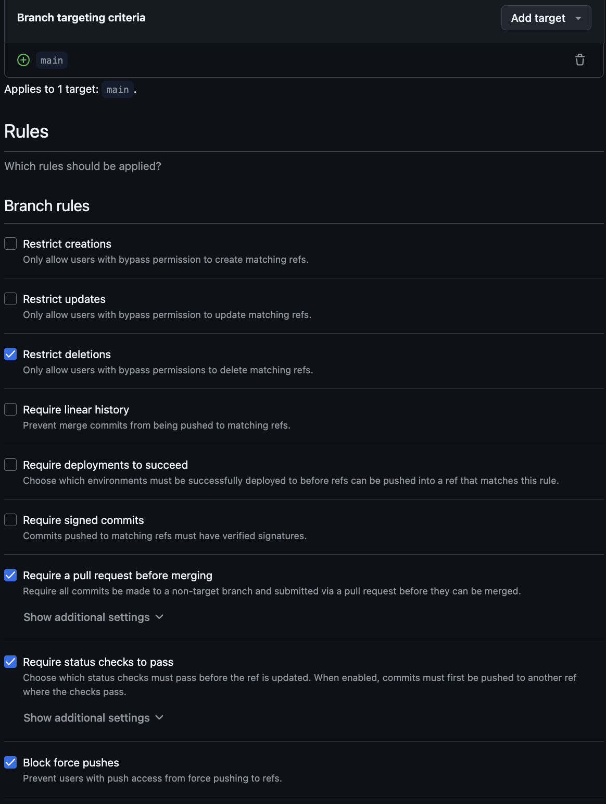
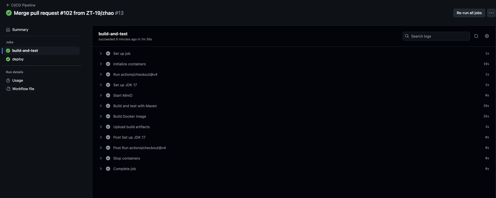
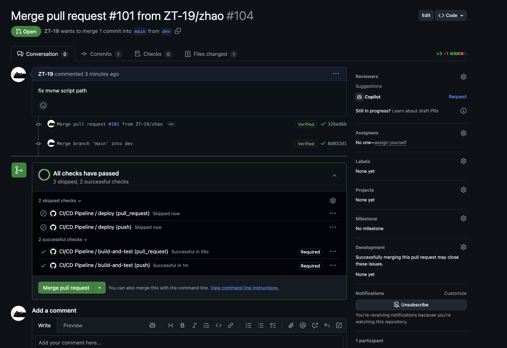

# CI/CD Workflow Documentation

[](https://github.com/ZT-19/grapevine/actions/workflows/ci-cd.yml)

This document outlines how our CI/CD pipeline satisfies project requirements and provides guidance for the development team.

## Requirements Compliance

### Requirement 1: Automatic CI Build on Pull Request
Our GitHub Actions workflow automatically triggers a build when a developer opens a pull request to either the `main` or `dev` branches:

```yaml
on:
  pull_request:
    branches: [ main, dev ]
```

### Requirement 2: Merge Protection
We've implemented branch protection rules in GitHub that:
- Require pull requests before merging to `main` and `dev`
- Require status checks (our CI workflow) to pass before merging
- Prevent direct pushes to protected branches

Screenshots of these settings are available in the [Branch Protection](#branch-protection) section below.

### Requirement 3: Automatic CI Build After Merge
Our GitHub Actions workflow triggers another build when changes are merged to protected branches:

```yaml
on:
  push:
    branches: [ main, dev ]
```

This ensures the integrated code is verified after every merge.

### Requirement 4: Automatic Deployment
Our workflow automatically deploys new builds after CI succeeds on the main branch:

```yaml
deploy:
  needs: build-and-test
  if: github.event_name == 'push' && github.ref == 'refs/heads/main'
```

## Documentation

### Branch Protection


*Branch protection rules for main and dev branches, requiring status checks and preventing direct pushes.*

### Pull Request Workflow


*Successful workflow run on a pull request, including all passing checks.*

### Deployment Workflow


*Successful deployment after merging to main branch.*

## Workflow Configuration

Our complete workflow configuration is available in `.github/workflows/ci-cd.yml`:

```yaml
name: CI/CD Pipeline

on:
  push:
    branches: [ main, dev ]
  pull_request:
    branches: [ main, dev ]

jobs:
  build-and-test:
    runs-on: ubuntu-latest
    steps:
      - uses: actions/checkout@v3
      - name: Set up environment
        uses: actions/setup-node@v3
        with:
          node-version: '16'
      - name: Install dependencies
        run: npm ci
      - name: Run linting
        run: npm run lint
      - name: Run tests
        run: npm test
      - name: Build
        run: npm run build

  deploy:
    needs: build-and-test
    if: github.event_name == 'push' && github.ref == 'refs/heads/main'
    runs-on: ubuntu-latest
    steps:
      - uses: actions/checkout@v3
      - name: Deploy to production
        run: |
          # Deployment commands here
          echo "Deploying to production environment"
```

## Developer Workflow

### Creating a Pull Request
1. Create a feature branch from `dev`
2. Make your changes and commit them
3. Push your branch and create a pull request targeting `dev`
4. Wait for CI checks to complete
5. Request code review
6. Merge once approved and all checks pass

### Promoting to Production
1. Create a pull request from `dev` to `main`
2. Wait for CI checks to complete
3. Request final review
4. Merge to trigger automatic deployment

## Status Monitoring

- CI/CD Pipeline: [GitHub Actions Dashboard](https://github.com/ZT-19/grapevine/actions)
- Production Environment (Currently not deployed): [Status Page](https://status.doamin.com)
